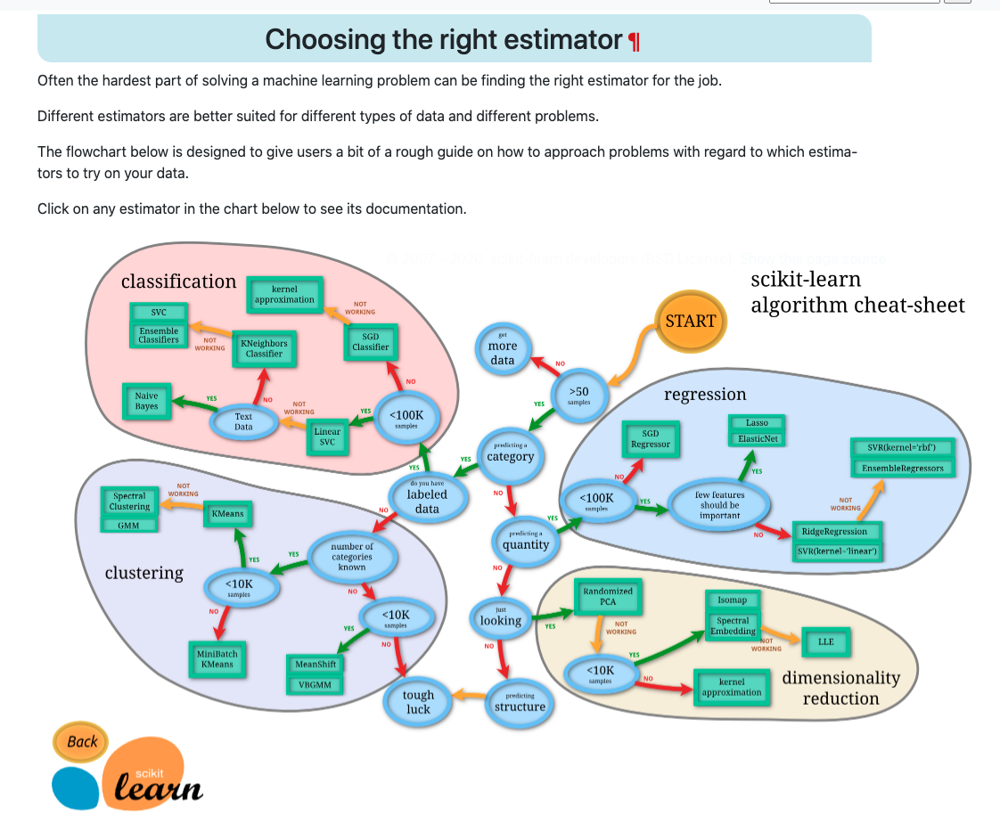

# Project: Exoplanet Exploration

## Objective
Over a period of nine years in deep space, the NASA Kepler space telescope has been out on a planet-hunting mission to discover hidden planets outside of our solar system.

To help process this data, create machine learning models capable of classifying candidate exoplanets from the raw dataset.

## Tools
* Python
* Jupyter Lab
* Scikit Learn library
* Pandas library

## Tasks
### Select the Right Models
[Model flowchart](https://scikit-learn.org/stable/tutorial/machine_learning_map/index.html)

### Preprocess the Data

* Preprocess the dataset prior to fitting the model.
* Perform feature selection and remove unnecessary features.
* Use `MinMaxScaler` to scale the numerical data.
* Separate the data into training and testing data.

### Tune Model Parameters

* Use `GridSearch` to tune model parameters.
* Tune and compare at least two different classifiers.

## Report
Based on the model flowchart, I decided to use 2 classification models: Support Vector Classification (model 1) and KNeighbors Classifier (model 2). 

Preprocessing the dataset was the same for both models, which included dropping null rows, selecting x and y values, split train and test data, scale the data, and label-encode 'y' objects.

SVC model:
* Training Data Score: 0.892
* Testing Data Score: 0.888
* After hyperparameter tuning: 0.888

KNeighbors model:
* Training Data Score: 0.873
* Testing Data Score: 0.842

Based on the outcomes, the SVC model came back with a higher score than KNeighbors.

